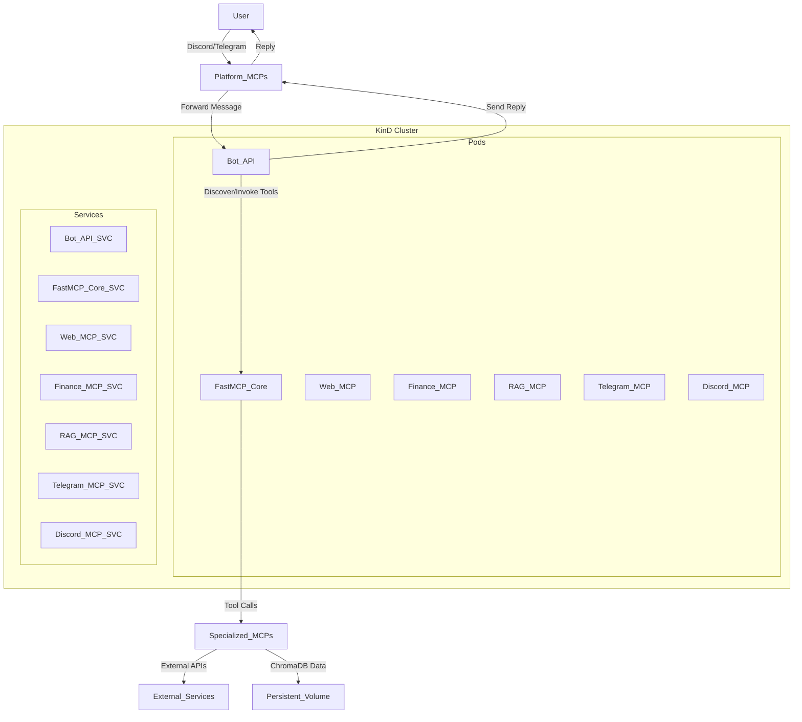

# Multi-Agent Bot with FastMCP and Kubernetes (KinD)

[](LICENSE)
[](https://kind.sigs.k8s.io/)
[](https://github.com/langchain-ai/langchain)

---

An extensible and scalable multi-agent AI bot system leveraging **LangChain**, **FastMCP**, and deployed on a local Kubernetes cluster using **KinD**.

## Table of Contents

1. [Features](#features)
2. [Architecture Overview](#architecture-overview)
3. [Getting Started](#getting-started)
   - [Prerequisites](#prerequisites)
   - [Setup & Deployment](#setup--deployment)
4. [Usage & Testing](#usage--testing)
5. [Project Structure](#project-structure)
6. [Contributing](#contributing)
7. [License](#license)

---

## ✨ Features

- **Modular Architecture**  
  Separate core logic, tool definitions (MCPs), and platform integrations.

- **Multi-Agent Reasoning**  
  Powered by LangChain and Groq LLMs for intelligent tool selection.

- **FastMCP Integration**  
  Dynamic discovery of specialized MCP servers for web search, finance, RAG, and more.

- **Platform Integrations**  
  - **Discord** via WebSocket  
  - **Telegram** via Webhook

- **Containerized Deployment**  
  Dockerized services for portability.

- **Local Kubernetes (KinD)**  
  Simulate production-like environment locally.

- **Persistent Storage**  
  RAG data stored in ChromaDB on PVC.

- **Automated Scripts**  
  Bash scripts to build images and deploy to KinD.

---

## 🏛️ Architecture Overview



1. **bot-api**: Core agent application using LangChain.
2. **fastmcp-core-server**: Central registry for MCP tools.
3. **Specialized MCPs**:  
   - `web-mcp`, `finance-mcp`, `rag-mcp`  
   - `telegram-mcp`, `discord-mcp` for platform communications.
4. **ChromaDB**: Vector store for RAG with PVC for persistence.
5. **KinD**: Local Kubernetes cluster orchestrating services.

---

## 🚀 Getting Started

### Prerequisites

- **Git**  
- **Python 3.12+**  
- **Docker Desktop** (4–8 GB RAM, 2–4 CPUs)  
- **KinD**  
- **kubectl**  
- **ngrok** (optional, for Telegram Webhook)

### Setup & Deployment

1. **Clone Repository**

   ```bash
   git clone https://github.com/your-username/multi-agent-bot.git
   cd multi-agent-bot
   ```

2. **Environment Variables**

   ```bash
   cp .env.example .env
   # Fill in your API keys and tokens
   ```

3. **Install Dependencies**

   ```bash
   pip install -r requirements.txt
   ```

4. **Build Docker Images**

   ```bash
   chmod +x scripts/build_images.sh
   ./scripts/build_images.sh
   ```

5. **Update Kubernetes Manifests**

   - Fill `k8s/secrets.yaml` and `k8s/configmaps.yaml` with values from `.env`.

6. **Deploy to KinD**

   ```bash
   chmod +x scripts/deploy_kind.sh
   ./scripts/deploy_kind.sh
   kubectl get pods -n multi-agent-bot
   ```

7. **Load RAG Data** (if applicable)

   ```bash
   kubectl apply -f k8s/jobs/rag-data-loader-job.yaml
   ```

---

## 🧪 Usage & Testing

1. **Logs**

   ```bash
   kubectl logs deployment/bot-api-deployment -n multi-agent-bot --tail 50
   ```

2. **Discord**

   - Invite bot and send messages.

3. **Telegram**

   - Port forward and use ngrok to set webhook.
   - Send messages via Telegram bot.

4. **Tool Queries**

   - **Web**: "What is the capital of France?"
   - **Finance**: "AAPL current stock price?"
   - **RAG**: "Performance of Alita on GAIA benchmark?"

---

## 📁 Project Structure

```
multi-agent-bot/
├── .env.example
├── .gitignore
├── README.md          # <- This file
├── requirements.txt
├── scripts/
│   ├── build_images.sh
│   ├── deploy_kind.sh
│   └── setup_webhooks.sh
├── common/
│   ├── utils.py
│   └── constants.py
├── mcp-servers/
│   ├── base-mcp/
│   ├── web-mcp/
│   ├── finance-mcp/
│   ├── rag-mcp/
│   ├── telegram-mcp/
│   └── discord-mcp/
├── bot/
├── k8s/
│   ├── deployments/
│   ├── services/
│   ├── jobs/
│   └── ingress/
└── tests/
    ├── test_mcp_servers.py
    └── test_bot_agent.py
```

---

## 🤝 Contributing

Contributions welcome! Please fork, create a feature branch, and submit a pull request.

---

## 📄 License

This project is licensed under the MIT License. See [LICENSE](LICENSE) for details.
